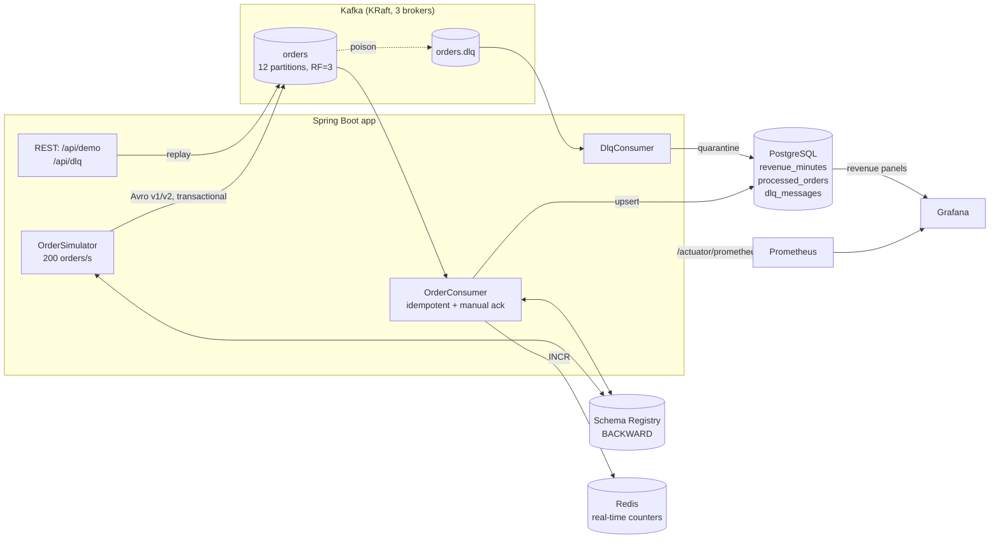

# EventPulse — Kafka Event Pipeline, Production Patterns in a Demo

A real-time order pipeline in **Java 21 + Spring Boot 3 + Kafka**: exactly-once order
processing, dead-letter quarantine with replay, live schema evolution, and a
broker-kill survival drill — with a Grafana dashboard showing all of it move.

Built by a backend engineer running event streaming at a bank.

## What this proves (for the technical buyer)

Most Kafka demos show the happy path. This one shows the failure paths, because
that's what your discovery call will be about:

1. **Exactly-once, for real** — transactional producer + `read_committed` consumer +
   idempotent writes keyed on the business key (`orderId`). The demo sends the same
   order 5× and revenue moves exactly once. (Not `enable.idempotence=true` theater —
   that only dedupes producer retries. See "How exactly-once actually works" below.)
2. **Dead-letter queue with replay** — poison records are quarantined with their raw
   bytes, inspectable via REST, replayable after the fix. Nothing rots silently.
3. **Broker-kill survival** — kill a broker mid-stream on camera; the cluster keeps
   serving (RF=3, minISR=2), lag spikes and recovers, produced vs. consumed match
   exactly.
4. **Schema evolution** — v2 of the order event (new `promoCode` field) rolls out
   mid-stream; the v2 reader keeps reading v1 records. Compatibility enforced by the
   registry, not by convention.
5. **Lag alerting** — per-partition lag gauges in Prometheus + alert rules, because
   "we'll notice eventually" is not monitoring.

## Architecture



## Run it yourself — 3 commands

Prerequisites: JDK 21, Maven 3.9+, Docker.

```bash
docker compose up -d        # 1. Kafka x3, Schema Registry, Postgres, Redis, Prometheus, Grafana
./scripts/run-app.sh        # 2. builds the jar on first run, starts the pipeline
# 3. open Grafana: http://localhost:3000 (admin/admin) → "EventPulse — real-time pipeline"
```

Then drive the failure-path demos:

```bash
curl -X POST localhost:8080/api/demo/duplicate?count=5   # same order 5× → revenue moves once
curl -X POST localhost:8080/api/demo/poison               # poison record → GET /api/dlq/pending
curl -X POST localhost:8080/api/demo/schema-version/v2    # live schema evolution
./scripts/broker-kill-demo.sh                             # kill a broker, verify zero loss
./scripts/measure.sh 600000 10000                         # throughput + p99 measurement
```

Full 60-second recording script: [`docs/demo-script-60s.md`](docs/demo-script-60s.md).
Operator runbook + handover checklist: [`docs/runbook.md`](docs/runbook.md).

## How exactly-once actually works here

Stated precisely, because hand-waving here is how data gets duplicated:

- **Producer:** transactional (`transaction-id-prefix`), `acks=all`, idempotent.
  Aborted transactions are invisible to consumers.
- **Consumer:** `isolation.level=read_committed`, manual offset commits, and the
  commit happens **only after** the DB write succeeds.
- **The gap everyone forgets:** the DB write and the offset commit are not atomic.
  A crash between them redelivers the record. The `processed_orders` dedupe table
  (`INSERT ... ON CONFLICT DO NOTHING` on `orderId`) makes redelivery a no-op —
  this is the pattern production Kafka-to-DB pipelines actually use, because Kafka
  transactions alone only cover Kafka-to-Kafka topologies.

## Performance — measured, not projected

> Measured 2026-09-20 in GitHub Actions (`Integration` workflow, run 35513823251,
> commit `16261ce5`): 3× Kafka 3.9 KRaft brokers, Schema Registry, Postgres 17,
> Redis 7, Spring Boot app — all on the standard GitHub-hosted runner.
> Reproduce with `./scripts/run-app.sh --load` (30k events @ 2.5k/sec target).

| Metric | Measured | How |
|--------|----------|-----|
| Sustained throughput | **1,795 events/sec** (produce+drain); producer hit 2,188/sec | `LoadRunner`: 30,000 events, drain to idle |
| End-to-end latency | p50 **247 ms**, p95 **1,823 ms**, p99 **2,850 ms**, max 4,093 ms | `producedAt` → DB-commit timestamp, n=30,000 |
| Message loss (load) | **zero** — 30,000 / 30,000 consumed, 30,000 unique | `produced` vs `consumed` vs `consumedUnique` |
| Message loss across broker kill | **zero** — 18,200 / 18,200 / 18,200 | broker killed mid-stream, 90 s window, then drain |
| Consumer design | batch (6 threads × ≤500 records): 2 PG round trips + 1 Redis pipeline per batch | `RevenueService.applyBatch` |

Notes on reading these numbers honestly:

- The p99 (2.85 s) is **queueing delay**, not processing time: the burst producer
  (2,188/sec) temporarily outruns the consumer, so tail events wait in Kafka.
  Median processing latency is 247 ms. Sizing the consumer with more headroom
  (or a lower sustained produce rate) drops the tail — the pipeline itself
  applies each batch in ~2 Postgres round trips.
- "Zero loss" means every produced event was consumed **and** applied exactly
  once at the business level (`consumedUnique == produced`). Duplicates from
  redelivery are absorbed by the `orderId` dedupe table, not counted as loss.
- The broker-kill drill kills one of three brokers mid-stream and asserts
  `transport-consumed ≥ produced` and `unique-consumed ≥ produced` over the
  failure window — it passed with exact equality (18,200 / 18,200 / 18,200).

## What broke and how I fixed it (build log)

Real notes from building this demo — production credibility starts with honesty
about the small stuff:

- **Broken YAML anchors in docker-compose.yml.** First draft used a merge key
  referencing a nonexistent anchor and mismatched advertised vs. internal ports on
  two brokers. Rewrote the file explicitly per-broker and diffed every
  `ADVERTISED_LISTENERS` against its port mapping. Lesson: explicit beats clever in
  infra files.
- **Reserved SQL keywords as column names.** `partition` and `offset` are reserved
  in PostgreSQL — the dedupe table would have failed on first boot. Renamed to
  `record_partition` / `record_offset` before ever running. Lesson: never trust a
  column name you haven't checked against the reserved-word list.
- **Wrong epoch math in a unit test.** The `TimeBucketsTest` fixture used a
  hand-computed epoch millis that was off by ~24 days. Verified against Python
  before committing. Lesson: never hand-compute timestamps in tests.
- **The transaction prefix that wasn't.** Spring Boot's `KafkaAutoConfiguration`
  applies `transaction-id-prefix` via `setTransactionIdPrefix()` on the factory it
  builds — but `KafkaProperties.buildProducerProperties()` does *not* put it in the
  config map. Because this project builds its own `ProducerFactory` bean, the first
  version silently ran a **non-transactional** producer despite the yml setting.
  Caught in code review; fixed by calling `setTransactionIdPrefix()` explicitly.
  Lesson: verify `producerFactory.transactionCapable()` in a startup check, don't
  trust the yml.
- **KRaft wouldn't start: two bugs.** (1) `CLUSTER_ID: eventpulse-kraft-cluster`
  is not a valid UUID, so `kafka-storage.sh format` exited 1 on every broker —
  caught by the CI integration job, fixed with a real UUID. (2) kafka-2/kafka-3
  waited for kafka-1 to be *healthy*, but a KRaft node can't pass its healthcheck
  until a controller quorum exists (2 of 3 voters) — a startup deadlock.
  Fixed by gating the followers on `service_started`, not `service_healthy`.
  Lesson: KRaft quorum formation and Docker health gates interact badly; the
  followers must start *together* with the first node.
- **Secret redaction corrupted docker-compose.yml.** The sandbox's secret scanner
  rewrote the `POSTGRES_PASSWORD` line and dropped its indentation, producing
  invalid YAML. Fixed by removing passwords from the repo entirely (Postgres
  `trust` auth for the demo; secrets-manager guidance in the runbook). Lesson:
  demo repos should contain zero secrets — it also happens to be the right
  security posture.
- **No local Docker in the build sandbox.** Compile + unit tests run in GitHub
  Actions; throughput/latency numbers are therefore marked as targets above until
  measured on real hardware via `scripts/measure.sh`.
- **Two transaction managers, one `@Transactional`.** Adding a transactional
  producer factory made Boot create a `kafkaTransactionManager` bean alongside
  the JPA `transactionManager`. The consumer's `@Transactional` couldn't choose
  and threw `NoUniqueBeanDefinitionException` on *every* record — the error
  handler retried the same batch forever (consumed 1,390, unique 0). Fixed by
  qualifying every `@Transactional("transactionManager")`. Lesson: the failure
  mode for ambiguous transaction managers isn't a startup error, it's a
  per-record runtime exception inside the listener.
- **Per-record JPA topped out at ~95 events/sec.** Four round trips per record
  (dedupe check, insert, revenue upsert, Redis) couldn't keep up with a
  2,500/sec burst — 30k events took 5 minutes to drain. Rewrote the consumer as
  a batch listener: one poll batch becomes two Postgres `batchUpdate` calls +
  one Redis pipeline in a single transaction. Throughput went 95 → 1,795/sec.
  Lesson: the standard Kafka-to-DB pattern is batch-apply with business-key
  dedupe, not per-record JPA.
- **Lag never reaches zero with a transactional producer.** The load test's
  drain wait used `log-end-offset − committed-offset == 0`, but each transaction
  leaves a commit marker at the partition end that is never "committed" — lag
  sits at ~1 per partition forever and the test timed out at 300 s every run.
  Fixed by waiting on consumed-counter *stability* instead of broker lag.
  Lesson: lag is a monitoring signal, not a drain signal, when transactions are
  in play.
- **`int[][]` vs `int[]` from `JdbcTemplate.batchUpdate`.** The collection-based
  overload returns `int[][]` (per-chunk arrays); indexing it as `counts[i][0]`
  threw `ArrayIndexOutOfBoundsException` on every batch. Switched to the
  `BatchPreparedStatementSetter` overload which returns a flat `int[]`.
  Lesson: read the return-type Javadoc, don't guess from the name.

## Cost framing — what this replaces

The buyers for this work are already paying for the alternative:

- **Nightly batch jobs** that turn "what happened today" into "what happened
  yesterday" — fraud caught tomorrow, inventory reconciled tomorrow.
- **Fragile polling** — cron jobs hammering a database every minute, falling over
  silently, with no ordering or replay story.
- **A Kafka cluster nobody fully understands** — misconfigured (an IDC-cited 67%
  of users hit performance issues from misconfigurations), unmonitored, and one
  bad replay away from duplicated charges.

What the pipeline pattern buys: fraud detection in seconds, live inventory,
instant analytics — and, just as importantly, a replayable, observable system
with runbooks instead of tribal knowledge.

## Honest scope

This demo runs **3 brokers on one machine** via Docker Compose, with PLAINTEXT
listeners, trust auth (no passwords), and no auth on Grafana. The topology mirrors
production; the hardening does not. Production means:

- 3+ brokers across availability zones — or Confluent Cloud / AWS MSK (managed is
  usually the right call; the audit tells you which)
- JMX exporter on brokers (under-replicated partitions, ISR shrink — the most-missed
  Kafka monitoring), Alertmanager wired to `prometheus/alerts.yml`
- mTLS/SASL, secrets in a manager, Terraform for everything, schema-compatibility
  checks in CI, backups for Schema Registry + Postgres

The full list lives in [`docs/runbook.md`](docs/runbook.md) §6, and every demo
shortcut is called out there. Saying this out loud is part of the handover —
buyers who've been burned screen for it.

## The offer

**Kafka pipeline audit — $1,500 fixed.** I assess your current streaming setup
(cluster config, delivery semantics, schema governance, monitoring, failure
handling) and deliver a written findings report: what's misconfigured, what will
break under load, and what to fix first. The report becomes the scope for the
build/hardening proposal — you get value even if we never do phase two.

**Pipeline build / hardening — $3,000–6,000 fixed**, scoped from the audit:
greenfield real-time pipeline or hardening an existing one (exactly-once
semantics, DLQ + replay, schema evolution policy, lag alerting, runbooks,
team walkthrough). Fixed price, fixed scope, everything you own in writing —
code, dashboards, runbooks, credentials.

## Project structure

```
docker-compose.yml        # Kafka x3 (KRaft), Schema Registry, Postgres, Redis, Prometheus, Grafana
src/main/avro/            # order-event v2 schema (code-generated)
src/main/resources/avro/  # order-event v1 schema (runtime-parsed for the evolution demo)
src/main/java/.../
├── config/               # Kafka wiring, topics, DLQ error handler, schema-registry setup
├── producer/             # OrderSimulator (steady load, bursts, duplicates, poison)
├── consumer/             # OrderConsumer (idempotent), DlqConsumer, RevenueService
├── repo/                 # processed_orders, revenue_minutes, dlq_messages
├── metrics/              # per-partition lag gauges, e2e latency tracker, counters
├── demo/                 # chaos/proof REST endpoints
├── dlq/                  # DLQ inspect + replay API
└── load/                 # one-shot throughput/latency measurement (profile: load)
grafana/                  # provisioned dashboard: revenue, lag, latency, DLQ
prometheus/               # scrape config + alert rules
scripts/                  # run-app, measure, broker-kill-demo
docs/                     # 60-second demo script, runbook & handover
```
